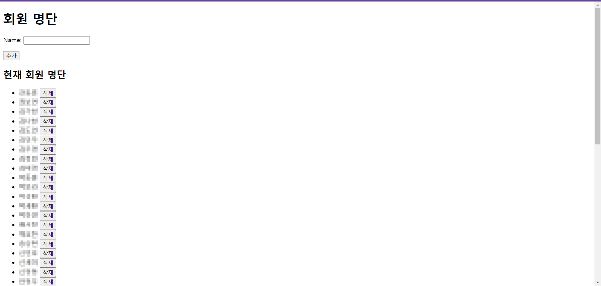

# Django를 이용한 동아리 활동시간 자동기록 프로그램!

와! 엑셀까지 다운로드 가능! 빠밤
## 회원 추가한 화면


## 활동 로그 찍는 곳 화면


## 현재 활동 로그에서 삭제 및 다운로드


# 실행 방법
```powershell
pip install -r requirements.txt
cd activity_logger
python manage.py runserver
```


